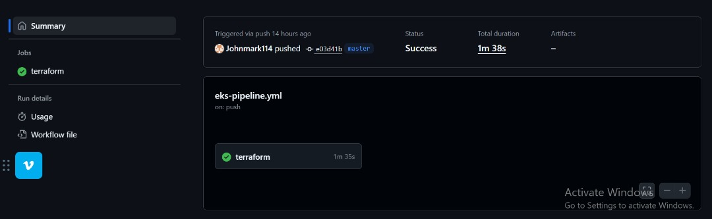

# InnovateMart EKS Deployment – Project Bedrock

### Name: Sylvia Chioma Okafor

### AltSchool ID: ALT/SOE/024/4939

---
## 📌 Overview
This repository contains my submission for the AltSchool Cloud Engineering Program (Semester 3, Month 2) assessment.

The goal of this project focuses on deploying **InnovateMart’s Retail Store Application** to AWS **Elastic Kubernetes Service (EKS)** with an emphasis on automation, security, and scalability.

The implementation covers:  
- **Infrastructure as Code (IaC)** using Terraform  
- **Kubernetes deployment** of microservices  
- **CI/CD automation** with GitHub Actions  
- **IAM roles and developer access**

---

## 🚀 Step 1: Provisioning Infrastructure with Terraform

1. I started by creating a Virtual Private Cloud (VPC) using Terraform. To ensure flexibility and reusability, I stored all variable values inside terraform.tfvars.

   - Defined CIDR block for the VPC.

   - Configured public and private subnets across multiple Availability Zones for high availability.

   - Attached Internet Gateway (IGW) to enable external connectivity for public subnets.

   - Created NAT Gateways to allow private subnets to access the internet securely.

   - Added Route Tables and associated them with the appropriate subnets (public or private).

  - Managed input variables via variables.tf and provided their values inside terraform.tfvars for better organization.

   This setup ensures the EKS cluster runs inside a secure, scalable, and highly available network.

   
   terraform.tfvars
    
   variables.tf
     

2. Provisioned **EKS cluster**:
   
   - After setting up the VPC, I provisioned an Amazon Elastic Kubernetes Service (EKS) cluster using Terraform.
   
   - Cluster Name: innovatemart-cluster
  
   - Kubernetes Version: 1.30
  
   - Node Group: t3.small (EKS Managed Node Group)
  
   - Scaling Configuration:

     Desired nodes: 2

     Minimum nodes: 2

     Maximum nodes: 4

     This setup ensures the cluster has enough compute capacity to handle workloads, while maintaining scalability through auto-scaling between 2–4 nodes.

     The cluster was configured with IAM roles, security groups, and add-ons (CoreDNS, VPC CNI, kube-proxy, etc.) to ensure proper networking, service discovery, and cluster management.
     
   - 
     
3. IAM Roles & Policies:  

   To enable secure access and fine-grained permissions, I created the following IAM roles and policies:
   
   - EKS Cluster Role – Grants the EKS control plane the necessary permissions to manage AWS resources such as EC2 instances and networking.

   - Node Group Role – Provides worker nodes (EC2 instances in the node group) with permissions to connect to the EKS cluster and interact with AWS services (e.g., pulling images from         ECR, using VPC CNI).

   - Read-Only Developer User – An IAM user with restricted access (view-only) to the cluster, following the principle of least privilege. This ensures developers can inspect resources        without making changes.
   
       
     
     IAM Console
     

---

## 🌐 Step 2: Deploying the Retail Store Application

- Installed and configured kubectl to connect with the EKS cluster.

- Applied the `kubernetes.yaml` file to deploy all the microservices.

- Verified deployment — all pods are in Running state ✅ (healthy cluster).

- The UI service is exposed as a LoadBalancer, and AWS automatically provisioned an Elastic Load Balancer (ELB) to make the application accessible externally.
 

- ## Kubernetes Services

To check the services in my cluster, I ran:

```bash
kubectl get svc

ui   LoadBalancer   172.20.99.37   aadfff0a2b7434dab89ee4f2d36a6f64-17783841.us-east-1.elb.amazonaws.com   80:30251/TCP   2m50s

``` 

Copied the URL and confirmed the UI was accessible.

LoadBalancer URL:[http://aadfff0a2b7434dab89ee4f2d36a6f64-17783841.us-east-1.elb.amazonaws.com](http://aadfff0a2b7434dab89ee4f2d36a6f64-17783841.us-east-1.elb.amazonaws.com)


##  ⚙️ Step 3: CI/CD Automation

To ensure repeatable and automated deployments, a GitHub Actions workflow was set up under .github/workflows.

The workflow handles:

- Terraform Initialization → Prepares the working directory with Terraform plugins and backend configuration.

- Terraform Plan (Feature Branches) → Runs terraform plan when code is pushed to non-main branches, helping preview infrastructure changes.

- Terraform Apply (Main Branch) → Automatically applies changes to AWS when changes are merged into main.

- Secure AWS Credentials → GitHub Secrets were used to store and inject AWS Access Keys, ensuring credentials are not hard-coded.

  
  
  
  

